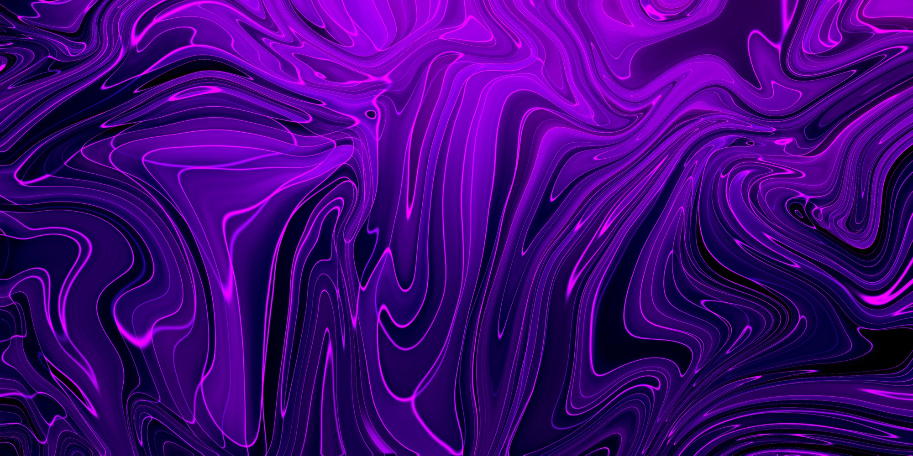

# KingCordGx

An Opera GX-inspired Discord theme configuration for **Vencord**, customized and maintained by [xM4j0rPr0bleZx](https://github.com/xM4j0rPr0bleZx).

KingCordGx uses a dark translucent layout, purple liquid artwork, neon accents, a custom galaxy Home icon, and the Chakra Petch font. It builds on the upstream [OperaGXTheme](https://github.com/L-Ratio/OperaGXTheme) stylesheet while keeping this project's configuration and install links under the KingCordGx repository.



## Install

### Vencord

1. Open **Settings → Vencord → Themes**.
2. Enable **Online Themes** if needed.
3. Add this URL:

```text
https://xm4j0rpr0blezx.github.io/KingCordGx/dist/KingCordGx.theme.css
```


## Project structure

- `src/KingCordGx.css` — KingCordGx settings and upstream theme import
- `dist/KingCordGx.theme.css` — installable Vencord loader
- `assets/kingcord-background.jpg` — purple liquid theme background
- `assets/kingcord-discord-logo.jpeg` — custom Discord Home icon

## Attribution

The base theme engine is provided by [L-Ratio/OperaGXTheme](https://github.com/L-Ratio/OperaGXTheme). 
KingCordGx contains the configuration and branding maintained by xM4j0rPr0bleZx.

## License

KingCordGx repository content is released under the [MIT License](LICENSE). The upstream dependency remains subject to its own license.
